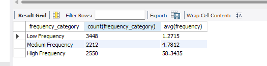

# DataAnalytics-Assessment

The questions can be found in this [file](https://docs.google.com/document/d/1qGaMGhLRYG3IsBfSHNrj8D5VlmxtjZxns17zC76T_5g/edit?tab=t.0) 

Question 1: Write a query to find customers with at least one funded savings plan AND one funded investment plan, sorted by total deposits.

The idea is to find customers who have both a funded savings plan and a funded investment plan. We can do this by joining the `customers` table with the `savings_plans` and `investment_plans` tables, filtering for funded plans, and then grouping by customer to ensure they have at least one of each type of plan. Finally, we sort the results by total deposits.

```sql
SET @naira_conversion = 0.01;
WITH funded_savings AS (
    SELECT owner_id, count(owner_id) as savings_count, SUM(amount) AS savings_total
    FROM savings_savingsaccount
    WHERE amount !=0
    GROUP BY owner_id
),
funded_investments AS (
    SELECT owner_id, count(owner_id) as invest_count, SUM(amount) AS investment_total
    FROM plans_plan
    WHERE amount !=0
    GROUP BY owner_id
)
```


We will then join the two tables to get the customers who have both funded savings and investments.
```sql
SELECT 
    u.id AS customer_id,
    u.name,
    fs.savings_count,
    fi.invest_count,
    (fs.savings_total + fi.investment_total) * @naira_conversion AS total_deposits
FROM users_customuser u
JOIN funded_investments fi ON fi.owner_id = u.id
JOIN funded_savings fs  ON u.id = fs.owner_id
ORDER BY total_deposits DESC;


```
Result:


--- 

### Question 2
 Calculate the average number of transactions per customer per month and categorize them:
* "High Frequency" (≥10 transactions/month)
* "Medium Frequency" (3-9 transactions/month)
* "Low Frequency" (≤2 transactions/month)

In this case, we will use the `savings_savingaccount` table to calculate the average number of transactions per customer per month. We also have to factor in the year for it to be a good trend. 

```sql
WITH monthlytransactions as (
    SELECT owner_id, count(owner_id) as frequency, 
            date_format(transaction_date, '%Y-%m') yearmonth ,
			CASE WHEN count(owner_id) <=2 THEN "Low Frequency" 
				WHEN count(owner_id) <9 THEN "Medium Frequency"
                ELSE 'High Frequency'
                END as frequency_category
    FROM Savings_savingaccount
    GROUP BY date_format(transaction_date, '%Y-%m'), owner_id) 

```
We will then categorize the customers based on the average number of transactions.
```sql
SELECT frequency_category, count(frequency_category), avg(frequency)
FROM monthlytransactions
GROUP BY frequency_category;
```
Output:


---

### Question 3

Find all active accounts (savings or investments) with no transactions in the last 1 year (365 days) .


In this case, we will use the `savings_savingaccount` and `plans_plan` tables to find all active accounts with no transactions in the last 1 year. We will use the `transaction_date` column to filter for accounts that have not had any transactions in the last 365 days.

```sql
WITH inactive AS (
		SELECT plan_id, owner_id, 'savings', 
			MAX(transaction_date) as Last_transaction_date, 
			DATEDIFF(CURDATE(), MAX(transaction_date)) as inactivity_days
    FROM savings_savingsaccount
    WHERE amount !=0 
    GROUP BY   owner_id
	HAVING inactivity_days >365
    
UNION ALL 
    SELECT plan_type_id , owner_id, 'investment', 
			MAX(start_date) as Last_transaction_date, 
			DATEDIFF(CURDATE(), MAX(start_date)) as inactivity_days
    FROM plans_plan
    WHERE amount !=0 
    GROUP BY owner_id
    HAVING inactivity_days >365
)

SELECT * from inactive

```
Output:


---
### Question 4
 For each customer, assuming the profit_per_transaction is 0.1% of the transaction value, calculate:
* Account tenure (months since signup)
* Total transactions
* Estimated CLV (Assume: CLV = (total_transactions / tenure) * 12 * avg_profit_per_transaction)
* Order by estimated CLV from highest to lowest

This is similar to question 1, but we will use the `users_customuser` table to get the account tenure and the `savings_savingaccount` and `plans_plan` tables to get the total transactions. We will then calculate the estimated CLV based on the formula provided.

```sql
SET @profit_per_transaction = 0.001 ;
SET @naira_conversion = 0.01;

WITH funded_savings AS (
    SELECT owner_id, count(owner_id) as savings_count, SUM(amount) AS savings_total
    FROM savings_savingsaccount
    WHERE amount !=0
    GROUP BY owner_id
),
funded_investments AS (
    SELECT owner_id, count(owner_id) as invest_count, SUM(amount) AS investment_total
    FROM plans_plan
    WHERE amount !=0
    GROUP BY owner_id
)

``` 
The Estimated CLV is calculated using the formula provided. 
```sql
SELECT 
    u.id AS customer_id,
    u.name,
    (fs.savings_count + fi.invest_count) AS total_transactions,
    -- Tenure in months (rounded down to integer)
    CONVERT((DATEDIFF(CURDATE(), u.created_on) / 30), UNSIGNED) AS Tenure,
    -- Estimated CLV calculation
    ROUND(
        ((fs.savings_total + fi.investment_total)/ NULLIF((DATEDIFF(CURDATE(), u.created_on) / 30), 0))
        * 12 * @profit_per_transaction* @naira_conversion,
        2) AS estimated_clv
FROM users_customuser u
JOIN funded_investments fi ON fi.owner_id = u.id
JOIN funded_savings fs ON fs.owner_id = u.id

ORDER BY estimated_clv DESC;

```
Output:


---

